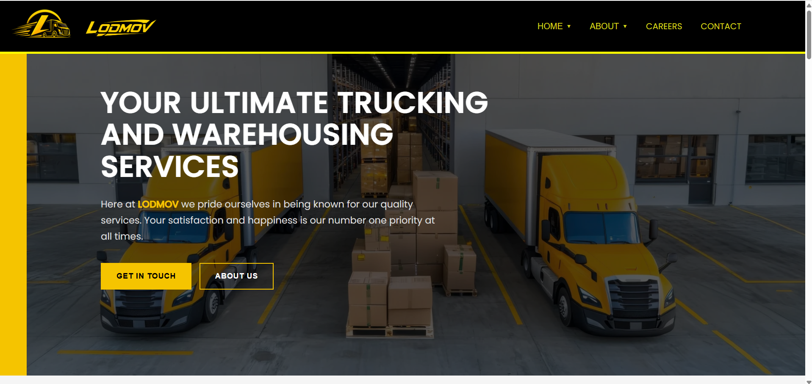
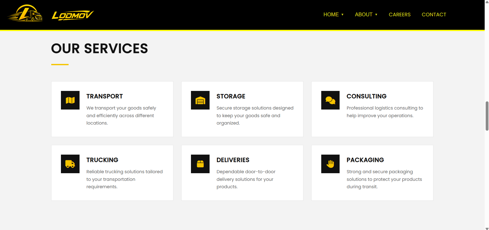
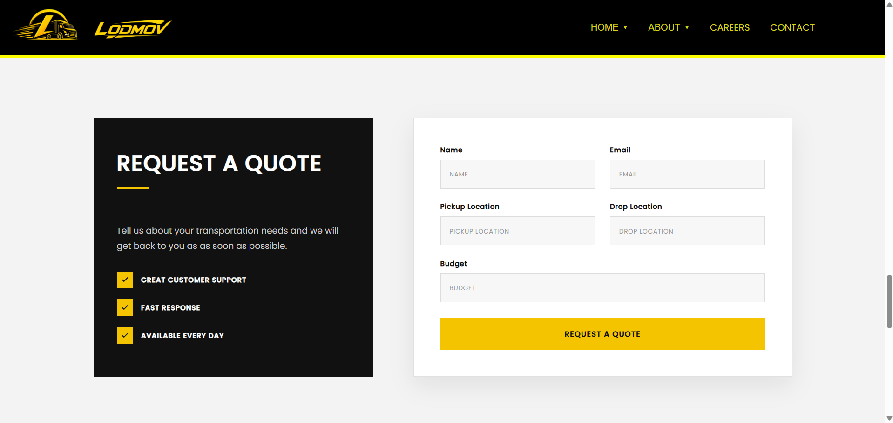
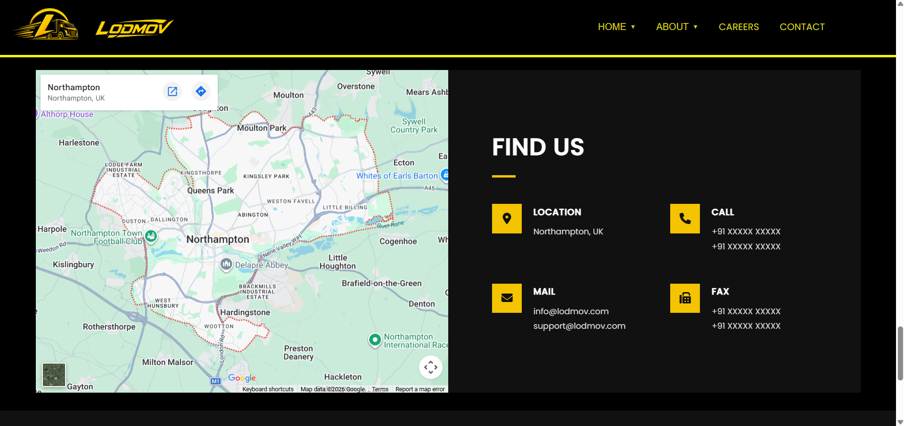
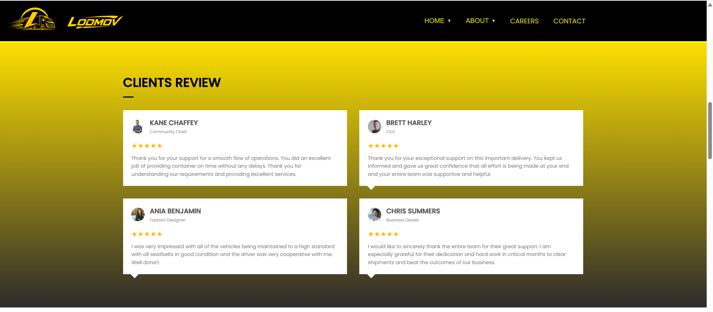
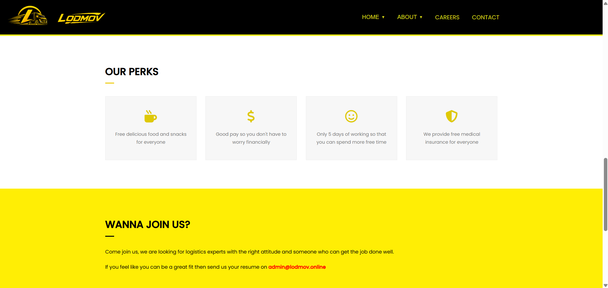
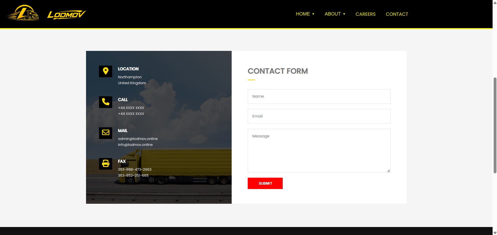
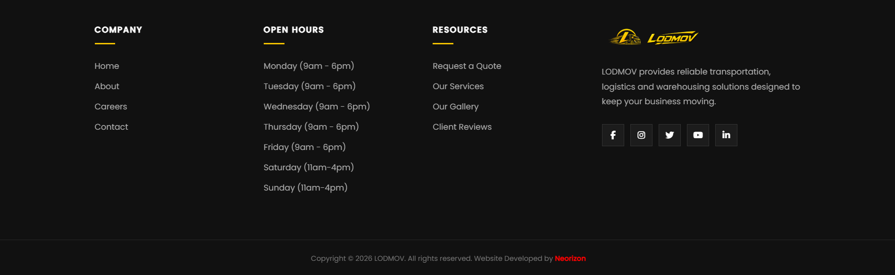

# 🚚 LODMOV | Transportation & Warehousing Website


---

## 🌐 About This Project

**LODMOV** is a professional multi-page website designed for a transportation, trucking and warehousing company.

The website presents LODMOV's services, company information, statistics, contact details and quote request functionality through a modern and 
responsive user interface.

The project focuses on creating a professional business presence while maintaining a clean structure, responsive layouts and an intuitive user 
experience across various devices.

---

## 🚀 Live Demo

🔗 **Website:** https://neorizonnn.github.io/Multi-Page-Website-Project/

---

## 📸 Preview

| Homepage | Our Services|
|----------|-------|
|  |  |

| Request Form | Find Us |
|----------|---------|
|  |  |

| Sample Client Review Section | Our Perks  |
|---------------|---------------|
|  |  |

| Contact Form  | Footer |
|---------------|---------------|
|  |  |

---

## ✨ Features

- Modern and professional business-oriented UI
- Fully responsive design
- Multi-page website structure
- Responsive navigation bar
- Mobile-friendly hamburger menu
- Trucking and warehousing service sections
- Company story and core values
- Statistics section
- Quote request form
- Contact and location section
- Google Maps integration

---

## 🛠️ Built With

- **HTML5** — Website structure and semantic markup
- **CSS3** — Styling, layouts and responsive design
- **JavaScript** — Interactive functionality
- **Google Fonts** — Typography
- **Font Awesome** — Icons
- **Google Maps** — Location integration

---

## 📂 Project Structure

```text
lodmov-website/
|
├── img/
│   └── ...
├── js/
│   └── script.js
├── sc/
│   └── ...
├── about.html
├── career.html
├── contact.html
├── index.html
├── README.md
└── sty.css

---
```

## 📄 Website Pages

### 🏠 Home

The homepage introduces LODMOV and highlights:

- Transportation and warehousing services
- Company story
- Core values
- Services
- Business statistics
- Quote request form
- Location and contact information

### ℹ️ About

Provides additional information about the company, its message, values and other company-related content.

### 💼 Careers

Provides information related to career opportunities and employment.

### 📞 Contact

Provides contact information and relevant ways for customers to get in touch.

---

## 🎯 Project Objectives

This project was developed to:

- Build a professional multipage business website
- Practice multi-page website development as a beginner
- Strengthen HTML, CSS and JavaScript concepts and skills
- Implement responsive web design
- Develop a practical real-world website structure
- Improve understanding of professional website layout and user experience

---

## 🔮 Future Improvements

Possible future improvements include:

- Backend integration for the quote request form
- Functional contact form submission
- Improved mobile navigation
- Additional animations and transitions
- Performance optimization
- SEO improvements
- Additional business functionality

---

## 👨‍💻 Developer

**Neorizon**

GitHub: https://github.com/Neorizonnn

Email: neorizon3@gmail.com

---

## 📄 License

This project is open for learning and inspiration.

Please do not copy it directly without proper permission.

Feel free to contact me anytime.

---

### ⭐ If you found this project interesting, consider giving it a star!